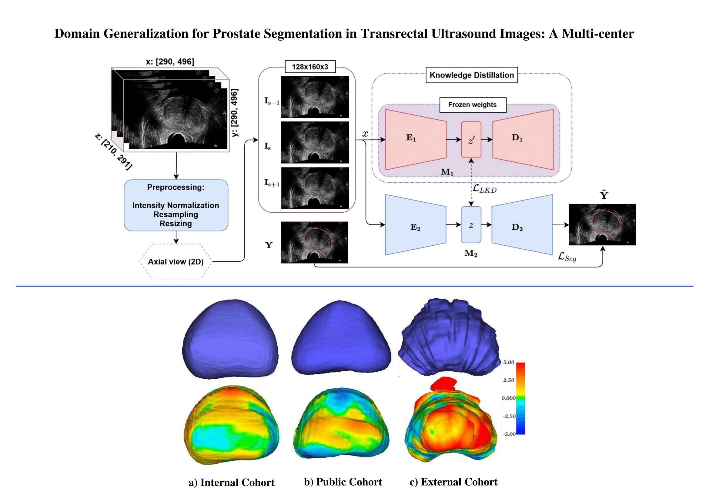

<div align="center">
 
# Domain Generalization for Prostate Segmentation in Transrectal Ultrasound Images: A Multi-center Study

[]()
[]()

</div>
Pytorch implementation of our paper: "Vesal et al.: Domain Generalization for Prostate Segmentation in Transrectal Ultrasound Images: A Multi-center Study [Medical Image Analysis, 2022].

Our source code has been tested successfully on Windows 10, Cuda 10.1, RTX 2080 Ti, Anaconda Python 3.7, PyTorch 1.7

The code is only for research purposes. If you have any questions regarding how to use this code, feel free to contact Dr.Mirabela Rusu (Mirabela.rusu@stanford.edu).

<table align="center" border=0><tr><td align="center" width="9999">


</td></tr></table>

---
## Abstract
Prostate biopsy and image-guided treatment procedures are often performed under the guidance of ultrasound fused with magnetic resonance images (MRI). Accurate image fusion relies on accurate segmentation of the prostate on ultrasound images. Yet, the reduced signal-to-noise ratio and artifacts (e.g., spackle and shadowing) in ultrasound images limit the performance of automated prostate segmentation techniques and generalizing these methods to new image domains is inherently difficult. In this study, we address these challenges by introducing a novel 2.5D deep neural network for prostate segmentation on ultrasound images. Our approach addresses the limitations of transfer learning and finetuning methods (i.e., drop in performance on the original training data when the model weights are updated) by combining a supervised domain adaptation technique and a knowledge distillation loss. The knowledge distillation loss allows the preservation of previously learned knowledge and reduces the performance drop after model finetuning on new datasets. Furthermore, our approach relies on an attention module that considers model feature positioning information to improve the segmentation accuracy. We trained our model on 764 subjects from one institution and finetuned our model using only ten subjects from subsequent institutions. We analyzed the performance of our method on three large datasets encompassing  2067 subjects from three different institutions.
Our method achieved an average Dice Similarity Coefficient (Dice) of 94.0(+/-0.03) and Hausdorff Distance (HD95) of 2.28 mm in an independent set of subjects from the first institution. Moreover, our model generalized well in the studies from the other two institutions (Dice: 91.0(+/-0.03); HD95: 3.7 mm and Dice: 82.0(+/-0.03); HD95: 7.1 mm). We introduced an approach that successfully segmented the prostate on ultrasound images in a multi-center study, suggesting its clinical potential to facilitate the accurate fusion of ultrasound and MRI images to drive biopsy and image-guided treatments.

### Comparison to Squeeze-and-Excitation block and CBAM


(a) Squeeze-and-Excitation block      (b) CBAM      (C) Coordinate attention block

## Dataset
Our study included patients data from three independent cohorts acquired at Stanford Medicine, [UCLA](https://wiki.cancerimagingarchive.net/pages/viewpage.action?pageId=68550661) and UCL, and it can not be shared at the moment. A detailed description of the training data can be found in the paper. For further information, please contact Dr.Mirabela Rusu ([Mirabela@stanford.edu](Mirabela@stanford.edu)).


## Dependencies
- Python 3.7
- PyTorch 1.7
- SimpleITK 1.2.2
- scikit-image
- scikit-learn

## Installation
 Please clone the repo as follows:
 
 ```
 git clone https://github.com/PIMED/TRUSGlandSegmentation/
 cd TRUSGlandSegmentation
```
To run the code without any OS compatibility issue the `environment.yml` is already exported (Windows 10). You can create the same environment as follows:
 ```
conda env create -f environment.yml
conda activate torch_gpu
```


## Train On Your Data
Please place your TRUS data and their corresponding labels in the dataset directory. To train our model on your data, you can run train.py file as following:
 
 ```python -u train.py```
 
 
# Inference
Our source code has been tested successfully on Linux Mint and Windows 10, Cuda 10.0, Quadro RTX 8000, Anaconda Python 3.8, PyTorch 1.7.0.

To test the model on your data, please place your TRUS data (images and corresponding segmentation masks) in the input folder:
```
-/input
  -/images
    -- case1_xxx_xxx.nii.gz
       ....
  -/masks
    -- case1_xxx_xxx_mask.nii.gz
       ....
``` 

## Visualization of segmentation results

Axial View                 |  Sagittal View            | Coronal View             |
:-------------------------:|:-------------------------:|:-------------------------:
   |  |  

 
 ## Citations
Please consider citing the following papers in your publications if the source code helped your research.
```bibtex

@misc{Natarajan2020,
    author       = {Natarajan, S. and Priester, A. and  Margolis, D. and Huang, J. and Marks, L. },
    title        = {{Prostate MRI and Ultrasound With Pathology and Coordinates of Tracked Biopsy (Prostate-MRI-US-Biopsy)}},
    year         = 2020,
    doi          = {10.7937/TCIA.2020.A61IOC1A},
    publisher    = {The Cancer Imaging Archive},
    }
    
@article{VESAL2022102620,
    title = {Domain generalization for prostate segmentation in transrectal ultrasound images: A multi-center study},
    journal = {Medical Image Analysis},
    volume = {82},
    pages = {102620},
    year = {2022},
    issn = {1361-8415},
    doi = {https://doi.org/10.1016/j.media.2022.102620},
    author = {Sulaiman Vesal and Iani Gayo and Indrani Bhattacharya and Shyam Natarajan and Leonard S. Marks and Dean C Barratt and Richard E. Fan and Yipeng Hu and Geoffrey A. Sonn and Mirabela Rusu},
}
    
```
